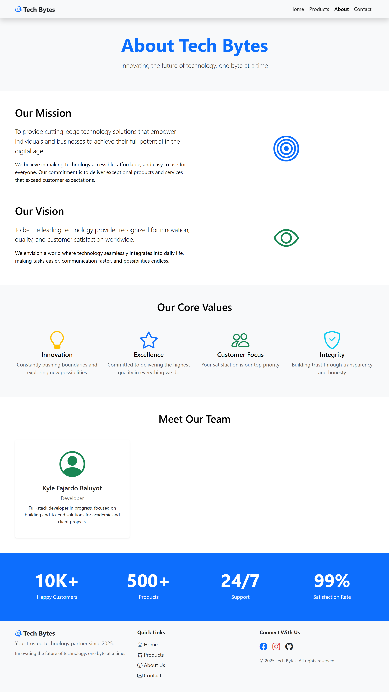
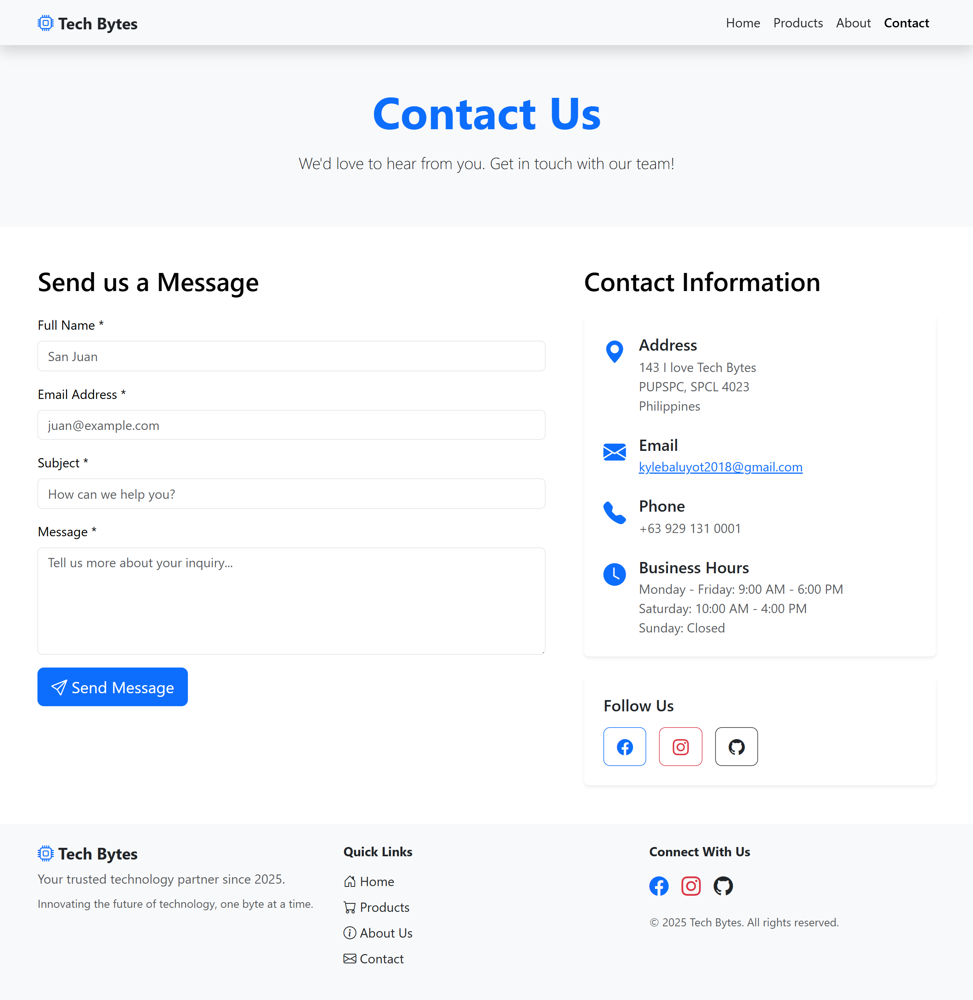

# Tech Bytes - E-commerce Demo Project


**Student Details:**
- Name: BALUYOT, KYLE FAJARDO
- Student Number: 2023-00354-SP-0
- Course & Section: BSIT 3-1
- Subject: COMP 016 - Web Development
- Activity: Laravel with Database Connection

## Project Overview

**Tech Bytes** demo website built to showcase the integration of **Laravel**, **Vue.js**, and **Bootstrap**.

This project was developed as a _COMP 016 - Web Development_ assignment.

## Key Features

- **SPA Navigation**: Seamless page transitions without full reloads using **Inertia.js**.
- **Reusable Components**: Modular architecture with reusable `Navbar` and `Footer` Vue components.
- **Fully Responsive**: Mobile-first design using **Bootstrap 5**, ensuring compatibility across all devices.
- **Sticky Navigation**: Smart navbar that stays accessible while scrolling.
- **Product Catalog**: Interactive product grid with category filtering (Laptops, Phones, Accessories, Software).
- **Simple UI/UX**: Clean aesthetics with consistent branding.

## Technology Stack

- **Backend**: [Laravel 10](https://laravel.com/) (PHP Framework)
- **Frontend**: [Vue.js 3](https://vuejs.org/) (Composition API)
- **Glue**: [Inertia.js](https://inertiajs.com/) (Server-driven SPA)
- **Styling**: [Bootstrap 5](https://getbootstrap.com/) & Bootstrap Icons
- **Build Tool**: [Vite](https://vitejs.dev/)
- **Language**: TypeScript / JavaScript

## Project Structure

```
resources/js/
├── components/         # Reusable Vue Components
│   ├── Navbar.vue      # Sticky Navigation Bar
│   └── Footer.vue      # Site Footer
├── pages/              # Page Views (Inertia)
│   ├── Welcome.vue     # Homepage
│   ├── Products.vue    # Product Listing & Filtering
│   ├── About.vue       # Company Info & Team
│   └── Contact.vue     # Contact Form & Map
└── app.ts              # Main Entry Point
```

## Getting Started

Follow these instructions to set up the project locally.

### Prerequisites

Ensure you have the following installed:

- PHP >= 8.1
- Composer
- Node.js & npm

### Installation

1.  **Clone the repository**

    ```bash
    git clone https://github.com/yourusername/tech-bytes.git
    cd tech-bytes
    ```

2.  **Install PHP dependencies**

    ```bash
    composer install
    ```

3.  **Install Node.js dependencies**

    ```bash
    npm install
    ```

4.  **Environment Setup**
    Copy the `.env.example` file to `.env`:

    ```bash
    cp .env.example .env
    ```

    Generate the application key:

    ```bash
    php artisan key:generate
    ```

5.  **Configure Environment**
    Open `.env` and set the `APP_URL`:
    ```env
    APP_URL=http://127.0.0.1:8000
    ```
    _Note: This project uses file-based sessions/cache for simplicity, so no database configuration is strictly required for the frontend demo._

### Running the Application

You need to run two terminal commands simultaneously:

1.  **Start the Laravel Development Server**

    ```bash
    php artisan serve
    ```

2.  **Start the Vite Development Server** (in a new terminal)
    ```bash
    npm run dev
    ```

Access the application at: `http://127.0.0.1:8000`

## Screenshots

### Homepage


The landing page features a hero section, feature highlights, and call-to-action buttons.

### Products Page


Browse products with dynamic category filtering (Laptops, Phones, etc.).

### About Us



Learn about our mission, vision, core values, and meet the team.

### Contact Us



Get in touch via the contact form or find our location.

---